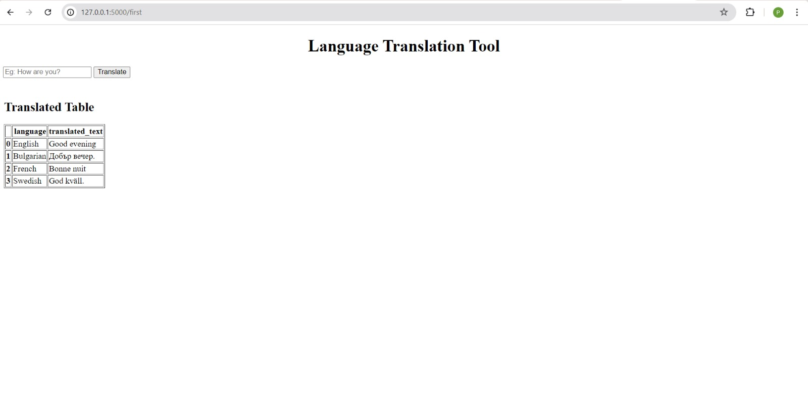

# Language-Translation
Language Translation Service project aims to develop a neural machine translation service capable of translating text from one language to another. Leveraging advanced Natural Language Processing (NLP) techniques and sequence-to-sequence models, we implemented and fine-tuned various models to achieve optimal translation accuracy. Our primary focus was on translating English to Swedish, French, and Bulgarian using publicly available datasets.

We conducted experiments with train, test and validation sets of Europarl dataset, a parallel corpus extracted from the European Parliament proceedings. This dataset is publicly available and provides aligned sentences in multiple languages, making it ideal for training machine translation models.

## Experimental results:
For English to Swedish, the Cartesinus model stands out with the lowest validation loss of 2.6224 and a BLEU score of 0.0225, making it the best choice. The Helsinki model with hyperparameter tuning also performs well with a validation loss of 2.7019 and a BLEU score of 0.0222.

For English to French, the Marian model is the top performer, achieving the lowest validation loss of 2.0636 and the highest BLEU score of 0.0207, indicating its superior translation quality.

For English to Bulgarian, only the Helsinki model is experimented, with a validation loss of 5.89687 and a BLEU score of 0.0121. 

## Webpage:
We have deployed our model into a webpage and here are the sample input and output images of the same:

  
  
  

